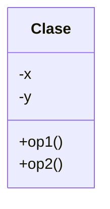

# Ejercicio-Relación de composición entre clases (Triángulo)

## Descripción del Problema

Construya la clase ```Triangulo``` haciendo composición con la clase ```Point```. Diseñe primero el **Diagrama de clases UML** y después programe.

Considere que para el cálculo del área del Triángulo puede usar la **Fórmula de Herón**:

$$area=\sqrt{s(s-a)(s-b)(s-c)}$$

donde:

$$s=\frac{a+b+c}{2}$$

## Ejemplo de ejecución
```
Dados los puntos:
P1=(3,1) P2=(1,2) P3=(4,4)
El perimetro del triangulo es:9.0039
El Area del triangulo es:3.5
```
## Diagrama de Clases



Referencia: [Diagramas de clase UML](https://mermaid.js.org/syntax/classDiagram.html)

# Diagrama de clases UML con draw.io

El repositorio está configurado para crear Diagramas de clases UML con ```draw.io```. Para usarlo simplemente agrega un archivo con extensión ```.drawio.png```, das doble clic sobre el mismo y se activará el editor ```draw.io``` incrustado en ```VSCode``` para edición. Asegúrate de agregar las formas UML en el menú de formas del lado izquierdo (opción ```+Más formas```).

Para más información consulta el [MarketPlace](https://marketplace.visualstudio.com/items?itemName=hediet.vscode-drawio).


## Objetivo

- Busca que el código pase correctamente todas las pruebas
   * Solamente cambia los archivos permitidos para lograr este objetivo (abajo se indican las reglas específicas)
   
- Las GitHub Actions deberán presentar una palomita en verde si se han satisfecho todas las pruebas, y una cruz roja cuando alguna (o todas) las pruebas han fallado.
   * **Recomendación:** Puedes dar clic en la cruz roja para verificar cual de las pruebas ha fallado (o si el código no ha compilado correctamente).
   * **Recomendación:** En caso de que el Autograding no muestre pruebas o no funcione, contacta a tu profesor mediante un issue.

## Instrucciones

- Revisa los archivos ```Point.cpp``` y ```Point.hpp``` y reutilízalos para implementar la clase ```Triangulo```.

Explicación de los otros archivos:

- Archivo `test/tests.cpp` tiene las pruebas de esta actividad (NO LO CAMBIES!)
- Archivo `test/catch.hpp` tiene la biblioteca de pruebas  CATCH2 (NO LA CAMBIES!)
- Archivo `makefile` tienes los comandos para ejecutar la actividad (NO LO CAMBIES!)
- Archivo  `./build/appTests` se generará después de compilar (para **pruebas locales**, solo ejecútalo)

## Comandos para pruebas locales, ejecución y depuración

- Comando para construir y ejecutar pruebas: `make` o `make test`
    * Si el ejecutable ya está construido, sólo teclea : `./build/appTests`

- Comando para construir y ejecutar la aplicación: `make run` 
    * Si el ejecutable ya está construido, sólo teclea : `./build/exercise`

- Comando para depurar: `make debug`
    * Para conocer los comandos de depuración consulta:
     https://u.osu.edu/cstutorials/2018/09/28/how-to-debug-c-program-using-gdb-in-6-simple-steps/
     
- Comando para depurar con `vsCode`: `make debugvs` 
    * Utilizar el depurador de la IDE.
      
- Comando para depurar pruebas con `vsCode`: `make debugtest` 
    * Utilizar el depurador de la IDE.

## Notas

- El código será evaluado solamente si compila.
   * La razón de esto es, si no compila no es posible generar el ejecutable y realizar las pruebas.

- Algunos casos de prueba podrían recibir calificación individual, otros podrían recibir calificación y si pasan todos juntos (o todas las pruebas en conjunto).

- La calificación final se otorgará de manera automática en cada *commit*, y se evaluará solamente hasta la fecha limite de la actividad.

Para dudas adicionales, consulta a tu profesor.

## License

MIT License 2020
